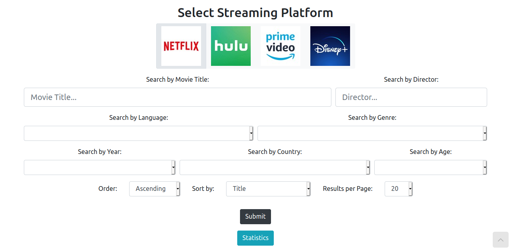

# Appathon-NTUA 2020

[Greek README](README.el.md)

## Movies on Streaming Platforms

### About
The purpose of this project is to create a Web Application in which a user can search movies to watch in different streaming platforms (Netflix, Hulu, Amazon Prime, Disney+). 

The user can filter the results with different criteria and choose to search on any number of the streaming platforms in order to find the desired movies. Also, some statistics are provided about the number of movies that are available on each platform in the form of a pie chart.

The application is based on an online database with over 16000 movies and info about them. The application also connects with the free [TheMovieDB](https://developers.themoviedb.org/3) API, in order to show a corresponding poster for each movie.



### Usage
The following GIF showcases the usage of the application:

> It might take some time to load.

### Main Features
- Inputs:
  - Streaming πλατφόρμα *(mandatory)*
  - Movie Title
  - Director
  - Language
  - Genre
  - Year
  - Country
  - Age

- Results can be ordered by:
  - Movie Title
  - Director
  - Year
  - Duration
  - IMDb Score
  - Rotten Tomatoes Score
  - Number of results per page

- Output:
  - The corresponding movies given the user's input.
  - In which streamin platforms each movie is available.
  - Poster for each movie, using the [TheMovieDB](https://developers.themoviedb.org/3) API.
  - Info about each movie, like (Movie Title, Director, Year, Genre, Language, Country, Duration, IMDb Score, Rotten Tomatoes Score, Age)
  - Chart with the number of movies in each platform.


### Technologies Used
- Database:
  - MySQL `Ver 14.14`
- Backend:
  - Node.js `v12.14.0`
- Frontend:
  - React (`create-react-app 3.3.0`)
  - Bootstrap `v4.5.2`
  - HTML / CSS
  - ChartJS

- Dataset by:
  - https://www.kaggle.com/ruchi798/movies-on-netflix-prime-video-hulu-and-disney, which is scraped from Reelgood.com.


## Installation

### Dependencies
- MySQL ή MariaDB server (`> v14.0`)
  - Installation for windows [here](https://www.apachefriends.org/index.html), using XAMPP.
  - Installation for Linux / Windows from the Official Guides [here](https://dev.mysql.com/doc/mysql-getting-started/en/).
- Node.js (`> v10.0`)
  - Installation for Windows/macOS [here](https://nodejs.org/en/download).
  - Installation for Linux using a packet manager [here](https://nodejs.org/en/download/package-manager/).

### Clone from GitHub
In a system folder we clone the repository and cd into it:
```bash
git clone https://github.com/thanoskoutr/Appathon-NTUA.git
cd Appathon-NTUA
```

### Database Setup
Inside the app we run the following command, which creates the database and the needed table:
```bash
mysql -u root -p < ./database/Movies.sql
```

Then, we run the following command, which fills the table with all the necessary data:
```bash
mysql -u root -p appathon_03116073 < ./database/appathon_dump.sql
```

### Environmental Variables (.env)
We open the file `./back-end/.env.example`, in order to enter the proper values at the environmental variables to allow our app to connect with the database, and the proper API key that we have to obtain from the TheMovieDB API.

#### Connection with the Database
We replace the `DB_USER`, `DB_PASS` variables with the credentials of the `root` user of the Database:
```ini
DB_HOST=localhost
DB_USER=root
DB_PASS=
DB_NAME=appathon_03116073
TMDB_API_KEY=
```

#### Connection with the TMDB API
For the TheMovieDB API, we first need to create an account at [TMDB](https://www.themoviedb.org/signup) and then from the account settings we have to request an API key.

If we don't enter an API key to the `TMDB_API_KEY` variable, we will just not have the ability to show the movie's poster.

#### Change filename
After all the changes to the `.env.example` file we save it as `.env`, in order for the app to read the variables correctly:

**Linux/macOS:**
```bash
mv ./back-end/.env.example ./back-end/.env
```

**Windows:**
```powershell
RENAME .\back-end\.env.example .env
```

### Deploy Script

**Linux/macOS:**
```bash
./deploy.sh
```

**Windows:**
```powershell
deploy.bat
```

When the deploy script its finished, then the app will be available at:
```
http://localhost:5000
```

### Notes
- *The app has been tested in the following browsers: Mozilla Firefox, Google Chrome, Microsoft Edge.*
- *The app has been developed on Linux (Ubuntu 18.04.5), but has been successfully tested on Windows 10, with MySQL through XAMPP and Node.js on Windows.*

### Manaul Deploy 
*In case of any error with the deploy script*

#### Start back-end
The back-end server will start after it has successfully connected with the Database:
```bash
cd ./back-end
npm install
npm start
```

#### Start front-end
Then, we start the front-end server which listens on port 5000. If we want to change the port we simple change the port number at the `serve` command:
```bash
cd ./front-end
yarn install
yarn build
npm install -g serve
serve -s build -l 5000
```
